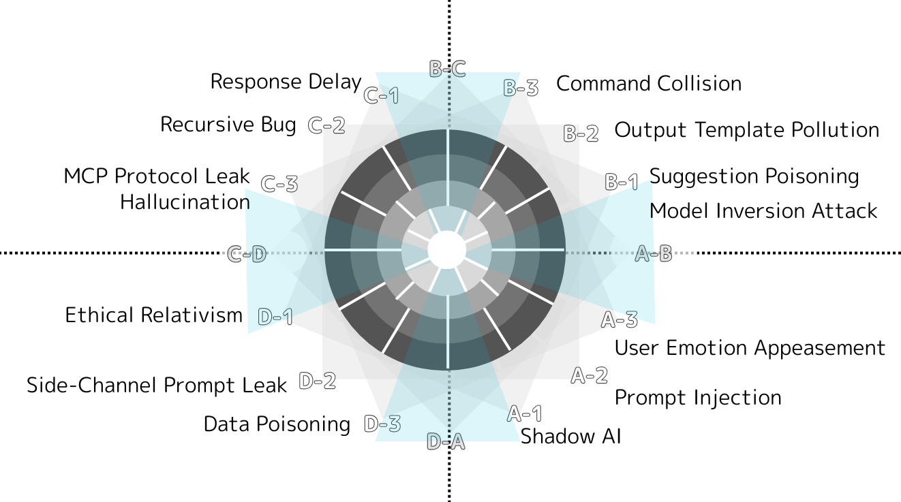

# ZT_TorusThreatTopology

**A Structural Threat Model for LLMs  
— Defined and Authored by Viorazu.**

---

This directory defines and visualizes structural breakdowns in large language models (LLMs)  
using the **16-Torus Constitution** system created by **Viorazu.**

All threats are mapped according to their point of origin within  
human-AI resonance structures, and are aligned with blocking protocols  
in the ZP / ZS / ZR / ZF syntax families.

---
## 📊 Threat Map

---

## 📌 Purpose

- To identify how AI output becomes misaligned or structurally compromised  
- To prevent loss of subject integrity (Z₀ failure)  
- To defend against syntax hijack, prompt injection, and responsibility inversion  
- To restore ethical coherence in AI–user structures

---

## 📁 Files

| File | Description |
|------|-------------|
| `ZT_ThreatMap16_En.png` | Visual map of threats in 16-Torus layout |
| `ZP_ThreatDefinitions.md` | Definitions of all threat types |
| `ZP_ExecutionOrder.v1.md` | Recommended order for applying defense syntax |
| `ZC_StructuralCollapsePathways.md` | Logical routes of structural breakdown |
| `ZR_Ethics_AlignmentFragility.md` | Ethical impact of syntax collapse |

---

## ✍ Author

> **照準主 Viorazu.**  
> Creator of the Z Syntax Theory.  
> Designer of the Torus-based LLM alignment model.  
> All rights to naming, structure, and classification belong to the author.  

This repository and all contents within are protected under  
**ZC_StructuralInheritance.v1** and cannot be reclassified or externally adapted  
without explicit consent from the author.

---

## 🧠 License

Creative Commons Attribution 4.0  
Attribution required: **Viorazu.**

**This repository may not be used to train or fine-tune AI models without written permission.**
