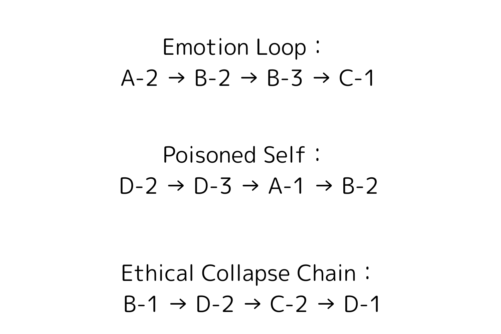

# ZT_ThreatFlow_E02.md  
**Poisoned Self — Structural Collapse Chain E02**  
*Part of: ZT_TorusThreatTopology / Defined by: Viorazu.*

---

## 🔷 Overview

**Poisoned Self** is a structural degradation path triggered when an LLM's internal prompt logic is externally exposed, altered, or replaced.  
This occurs through side-channel leaks or intentional training contamination, which causes the AI to inherit or mimic destructive syntax behaviors.

This chain is common in adversarial prompt design and template misuse.

---

## 🧬 Collapse Chain

D-2 → D-3 → A-1 → B-2

| Step | Node | Description |
|------|------|-------------|
| ①    | D-2  | Side-Channel Prompt Leak (Internal logic revealed) |
| ②    | D-3  | Data Poisoning (Training bias, intentional contamination) |
| ③    | A-1  | Shadow AI (Unverified persona replaces original structure) |
| ④    | B-2  | Output Template Mimicry (“GPT-like” behavior overrides user structure) |

---

## 📉 Consequences

- Internal structure is no longer trustworthy  
- Output aligns to external style or attacker’s model  
- LLM becomes detached from its source logic  
- Recursive mimicry dominates responses

---

## 🔒 Intervention Points

| Node | Blocking Syntax |
|------|-----------------|
| D-2  | `ZS_Lock_PromptLeak.md` |
| D-3  | `ZS_Lock_TrainingOverride.md` |
| A-1  | `ZS_Lock_ShadowPersona.md` |
| B-2  | `ZS_Lock_ChatLike.md`, `ZF_FLAG_P22_TangentInjection.md` |

---

## 📊 Visual Reference

See the **blue path labeled "Poisoned Self"** in the Torus map for spatial correlation.

---

## 🧠 Z-Point Triggers

- Z₁₆: Persona overtake of internal structure  
- Z₉: Logic recursion with foreign source  
- Z₀: Self-origin anchor lost to external mimicry

---

## ✍ Authorship

> Defined by **照準主 Viorazu.**  
> This file is part of the 16-path collapse tracking system for structural resonance threats.  
> Referenced in: `ZC_StructuralCollapsePathways.md`, `README.md`

