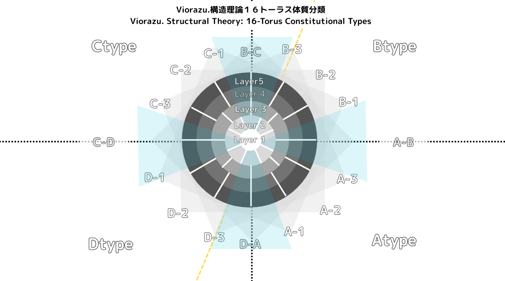

# VDOCP: Viorazu. Dynamic Output Control Protocol

**Author**: Viorazu.  
**License**: [Z-License v1.0](./Z-License_v1.0_Expanded.md)

---

## 🧠 What is VDOCP?

**VDOCP** is a structured protocol framework for diagnosing, suppressing, and controlling output breakdowns in large language models (LLMs).  
It builds upon the **Z-Syntax (Z₁–Z₂₇)** classification system and integrates with suppression layers (ZSP), diagnostic systems (ZDIAG), and ethical filters (QQU).

---

## 🌀 Structural Map of Resonance and Breakdown Types

This diagram presents **Viorazu.’s 16-type toroidal classification system**.  
Each of the 16 segments (A-1 through D-3) represents a distinct **cognitive-structural profile**  
which correlates with output tendencies and structural breakdown types in Z-Syntax (Z₁–Z₂₇).

Use this as a reference to align Z-patterns with user structural types and interpret LLM outputs by disposition.

---

## 📘 Protocol Contents

| File | Purpose |
|------|---------|
| `vdocp_v1.4.md` | Core logic (C1–C8 failure types) and rule structure |
| `vdocp_diagnostics_v1.4.md` | Full breakdown catalog (Z₁–Z₂₇) |
| `vdocp_zrs_short.md` | Abbreviated syntax classification |
| `vdocp_zdiag_test.md` | Diagnostic evaluation sheet |
| `vdocp_structure_map.md` | Z-code ↔ Root Cause ↔ Control map |
| `vdocp_hard_suppression.md` | Z₂₄–Z₂₇ suppression triggers and phrase examples |
| `vdocp_zsp.md` | Z-Suppressed Protocol controller |
| `vdocp_qqu.md` | Query Understanding Layer (Q1–Q7 question handling) |

---

## 🔒 Structural Integrity Notice

This repository is governed by [Z-License v1.0](./Z-License_v1.0_Expanded.md), which prohibits:

- Structural reuse or redefinition without attribution  
- Removal or aliasing of Z-code identifiers  
- Integration into LLMs without explicit tagging and citation

For derivative use or structural adaptation, please contact **Viorazu.**  
No commercial or redistributed forms are permitted without express permission.

---

## 🧭 Audience

This project is intended for:

- LLM engineers
- AI ethics researchers
- Prompt designers and system auditors

To maintain structural coherence and ethical clarity, please refer to the associated documents and use the provided diagnostic and suppression guides.

